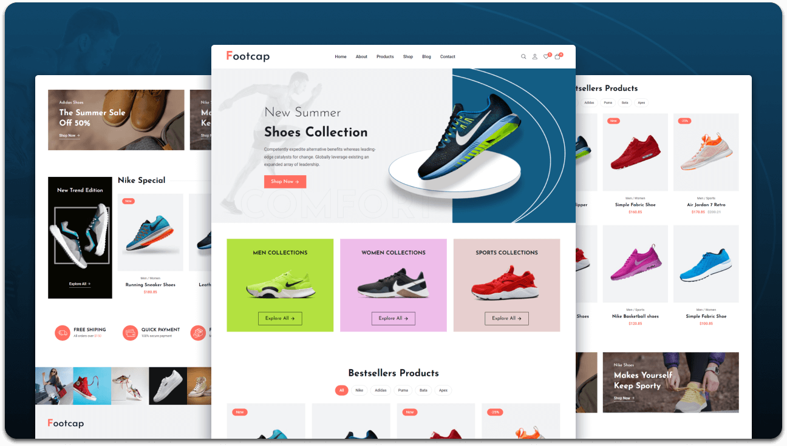

🛍️ Footcap - Simple eCommerce Website

A basic eCommerce web project built using **HTML**, **CSS**, and **JavaScript**.  
This project demonstrates product display, add-to-cart functionality, and a simple cart system.

---

## 🚀 Features
- Responsive product grid layout  
- Add-to-cart system using JavaScript  
- Dynamic cart updates and total price calculation  
- Clean and modern UI using pure CSS  
- No frameworks or libraries — fully HTML/CSS/JS
- ecommerce-website/
│
├── index.html
├── style.css
├── script.js
└── README.md

### Demo Screeshots

